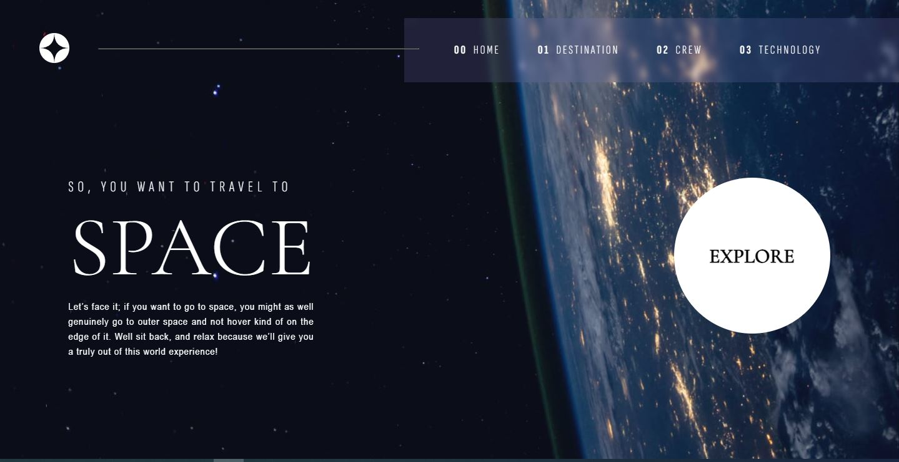

# Frontend Mentor - Space tourism website solution

This is a solution to the [Space tourism website challenge on Frontend Mentor](https://www.frontendmentor.io/challenges/space-tourism-multipage-website-gRWj1URZ3). Frontend Mentor challenges help you improve your coding skills by building realistic projects. 

## Table of contents

- [Overview](#overview)
  - [The challenge](#the-challenge)
  - [Screenshot](#screenshot)
  - [Links](#links)
- [My process](#my-process)
  - [Built with](#built-with)
  - [What I learned](#what-i-learned)
  - [Useful resources](#useful-resources)
- [Author](#author)
- [Acknowledgments](#acknowledgments)

## Overview

### The challenge

Users should be able to:

- View the optimal layout for each of the website's pages depending on their device's screen size
- See hover states for all interactive elements on the page
- View each page and be able to toggle between the tabs to see new information

### Screenshot

### Links

- Solution URL: [Github solution repo](https://github.com/aljager1983/space-tourism-website-react)
- Live Site URL: [Frontend Mentor | Space Tourism Website](https://aljager1983.github.io/space-tourism-website-react/)

## My process

### Built with

- Semantic HTML5 markup
- CSS custom properties
- Flexbox
- CSS Grid
- [React](https://reactjs.org/) - JS library

### What I learned

This is the first project where I employed react framework. I proved difficult for a first-timer like me, so hard that it had more than 50 commits. I had additional difficulty when I uploaded online since some informations have to linked online. Luckily I had stack overflow to lean on some information inorder to finish the project.

### Useful resources

- [Stackoverflow](https://www.stackoverflow.com) - This helped me for the json loading issue when i loaded my file online.
- [React deployment on github pages](https://https://create-react-app.dev/docs/deployment/) - This helped me in loading my react project in github pages
- [Page for information on screen sizes] (https://www.altamira.ai/blog/common-screen-sizes-for-responsive-web-design/)

## Author

- Frontend Mentor - [@aldrinbfernandez](https://www.frontendmentor.io/profile/aldrinbfernandez)
- Twitter - [@promdiGamer](https://twitter.com/promdiGamer)

## Acknowledgments

The courses I have undergone in Udemy with Dr. Angela is helping me a lot. Had couple of notes during that bootcamp and I'm now they are helping a lot since I can't remember most of the syntaxes.

<!-- https://mykhailo-hudzevatyi.medium.com/what-are-the-best-screen-sizes-for-responsive-web-design-in-2020-47a7d2401432 -->
<!-- https://www.browserstack.com/guide/responsive-design-breakpoints -->
<!-- https://www.altamira.ai/blog/common-screen-sizes-for-responsive-web-design/ -->
